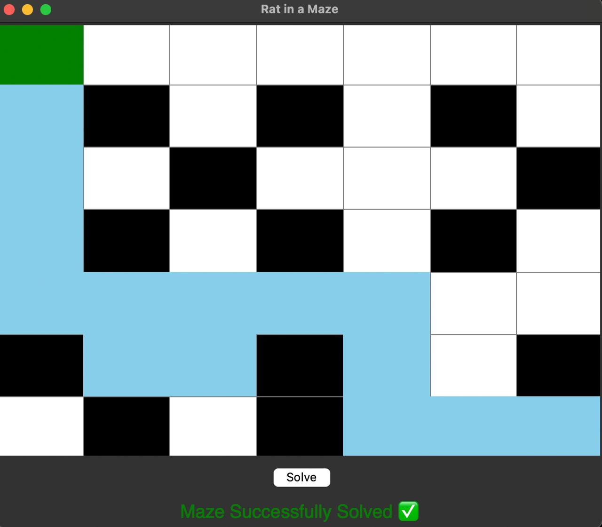

# 🐭 Rat in a Maze - Python Tkinter Visualizer

An interactive Python project that visually solves the classic *Rat in a Maze* problem using *backtracking* and *Tkinter*. This project allows users to input their own maze, watch the rat traverse it with a smooth animation, and view success or failure messages based on the path availability.

---

## 📌 Features

- Input your own maze grid (1 for open paths, 0 for walls).
- Start cell shown in *green, end cell in **red*.
- Solves the maze using *recursion* and *backtracking*.
- Smooth *step-by-step animation* of the rat's movement in blue.
- *Responsive UI* — auto resizes with window changes.
- Displays:
  - ✅ “Maze Successfully Solved”
  - ❌ “No Path Found” (closes automatically)

---

## 🧠 Algorithm

This project uses *backtracking* to explore all possible paths recursively. When a valid move is found, it continues; if blocked, it backtracks and tries alternative routes.

---

## 🖼 Screenshots

> Add your own screenshots here (drag and drop in GitHub or use  syntax)

---

## 🚀 Getting Started

### Prerequisites

- Python 3.x

### Installation

```bash
git clone https://github.com/your-username/rat-in-a-maze.git
cd rat-in-a-maze
